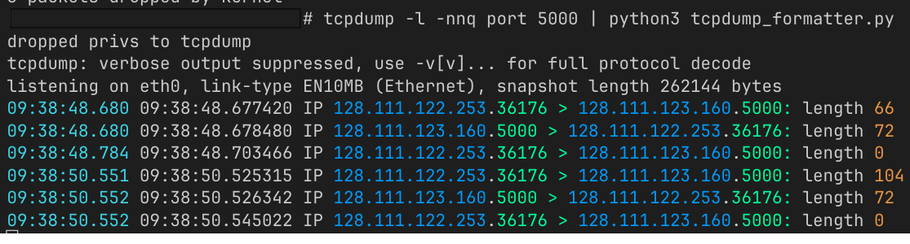

# TCPColor
Add color to a basic tcpdump with standard python3 libraries.

## Usage

```shell
$ tcpdump -l -nnq <tcpdump filter> | tcpcolor.py
```

I generally always use these flags so this utility will only work properly when using them. 

`-nn    Don't convert protocol and port numbers etc. to names either.`

`-q     Quick (quiet?) output.  Print less protocol information so output lines are shorter.`



